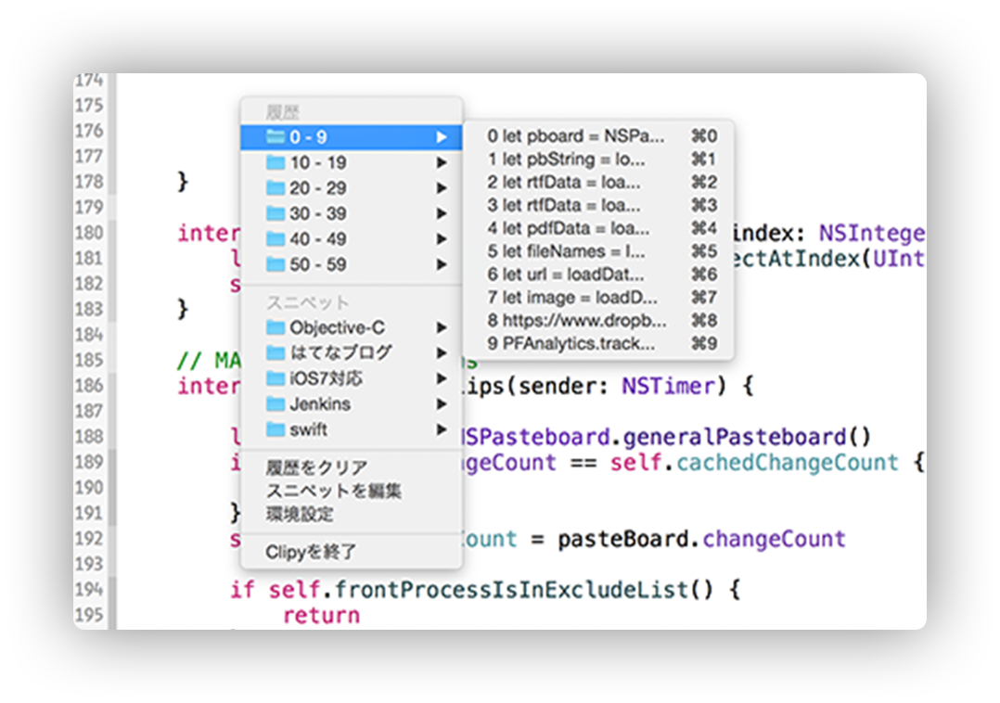

# 是 POC 還是最終版？ | 用 C# 實作 Windows 剪貼簿管理工具

## 前言

在 macOS 我使用 [Clipy](https://github.com/Clipy/Clipy) 來管理我的剪貼簿，它不但可以儲存你所複製過的東西還可以自訂分類，而且提供了快速鍵可以直接呼叫出選單來使用，非常的直覺及方便。

但在新的公司使用的環境是 Windows，所以勢必得找另一款軟體來取代 clipy（他沒有 Windows 版），在稍稍搜尋過後覺得沒有合胃口的，便萌生了自己開發的想法。畢竟第一個接觸的程式是在高職計概課的 VB，那時候也就透過 VB 寫過不少功能簡單的桌面應用程式，但這次我想使用 C# 來開發看看。

> 我也是 Google 才知道而且與本文完全無關的小知識：
> 中文裡使用的全形小括號叫做「夾注號」，在夾注號後直接接上逗號是正確的文法。但是我覺得看起來有點怪 QQ。

## POC

在有了這個想法之後我便馬上著手開發 POC，畢竟之前碰 C# 的經驗比日本製造的壓縮機還要稀少，只有在學校的 Unity 課堂及作業中使用，根本不知道我做不做得出來，所幸經過兩三天瘋狂的 Google 後，終於有了初步的成果讓我確定這個想法沒有問題。

運作的方式就是有一個 Windows Form 用來管理我儲存的分類，然後透過 Alt + V 呼叫出快捷選單，點選想複製的項目後再自行按下 Ctrl + V 貼上。歷史複製資料其實也有弄出來，但是因為複製多行的時候會有一些問題，而且目前可以用內建的 Windows + V 來取代這項功能，我就先拿掉了。

目前這個 POC 用在我工作上是還滿開心的，它有夠簡單而且也算是方便，所以我很怕這個會變成我的最終版 XD。

## POC 之後？

首先一定要先重構並做出一樣的基本功能，目前我的 Code 說它是屎的話可能[日本大便學會](https://unkogakkai.jp/)還會來信抗議，因為是求快的關係基本上毫無結構可言，但關於 C# 的結構我完全不知道，所以第一個 task 應該是好好看一下 C# 開發相關的文章等等，然後就先從模仿開始吧！

等到確定好架構後，開始重構、改善及增加功能、美化 UI、改善 UX，希望這些我真的都做得到。

未來希望這個系列的文章（會有第二篇嗎？）能夠分成兩類，在實作前先有一篇概念篇，練習把自己的想法表達出來，然後幻想會有網友在我提出概念的時候就先來幫我 debug。

## 台階

換新工作才剛滿一個月，沒有時間做 side project 很合理吧？
畢竟我已經有 POC 能用了。

## LINK

* [是 POC 還是最終版？ | 用 C# 實作 Windows 剪貼簿管理工具](https://github.com/dang113108/forum_post)
